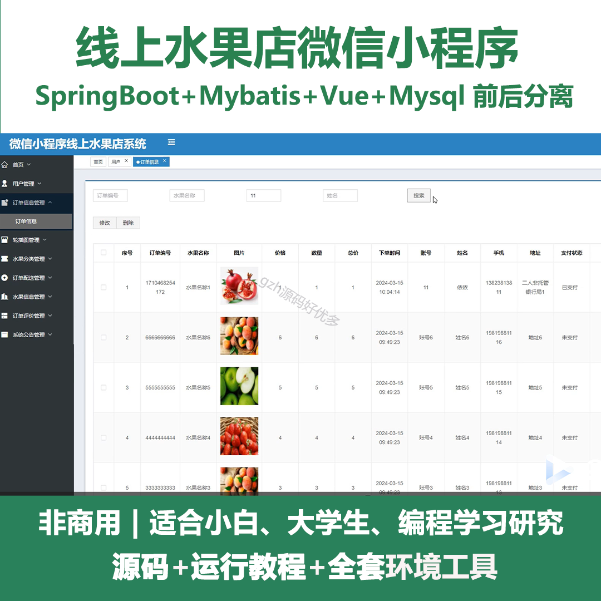
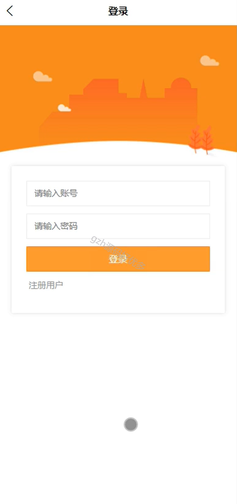
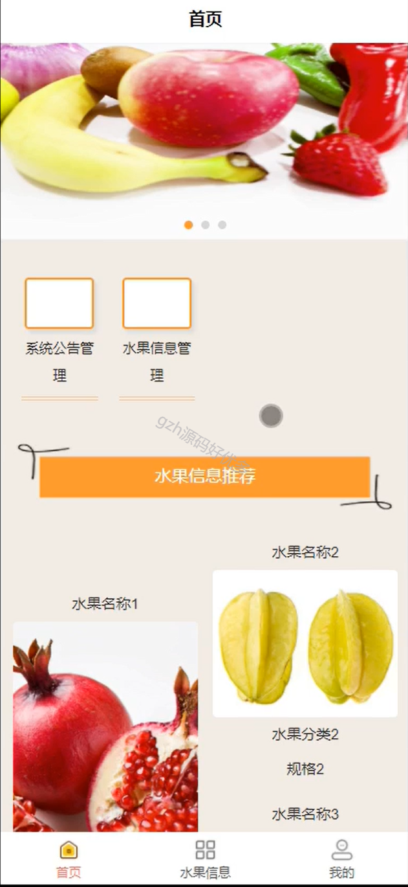
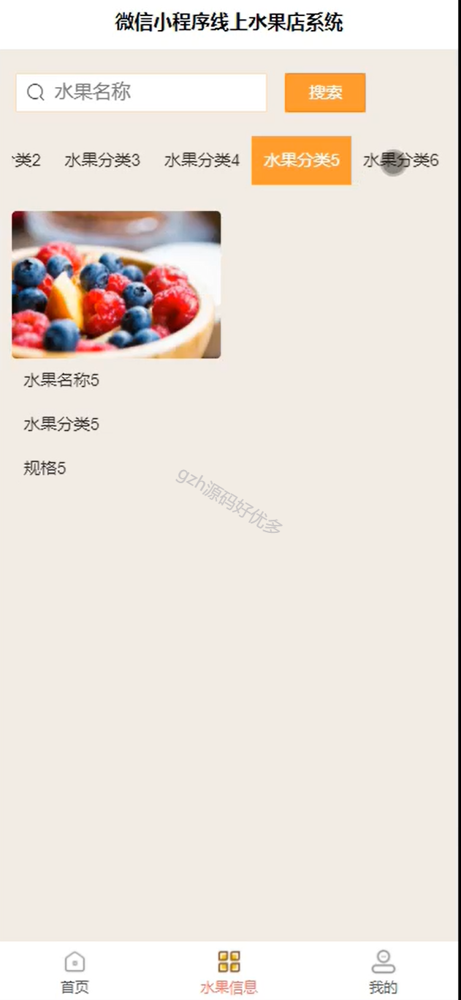
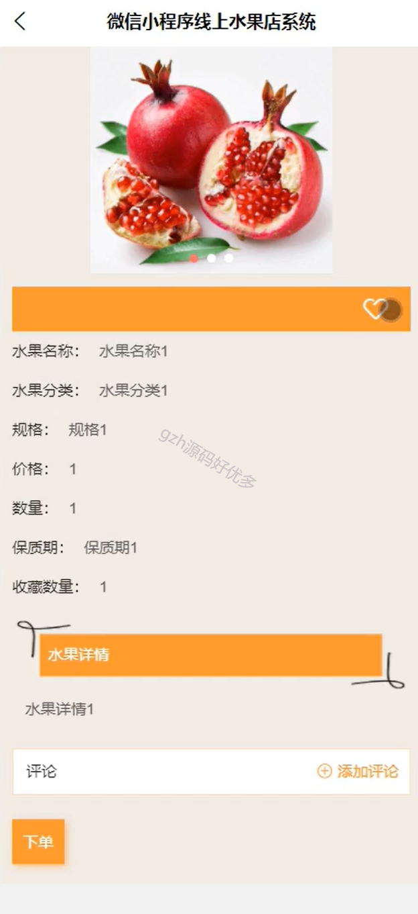
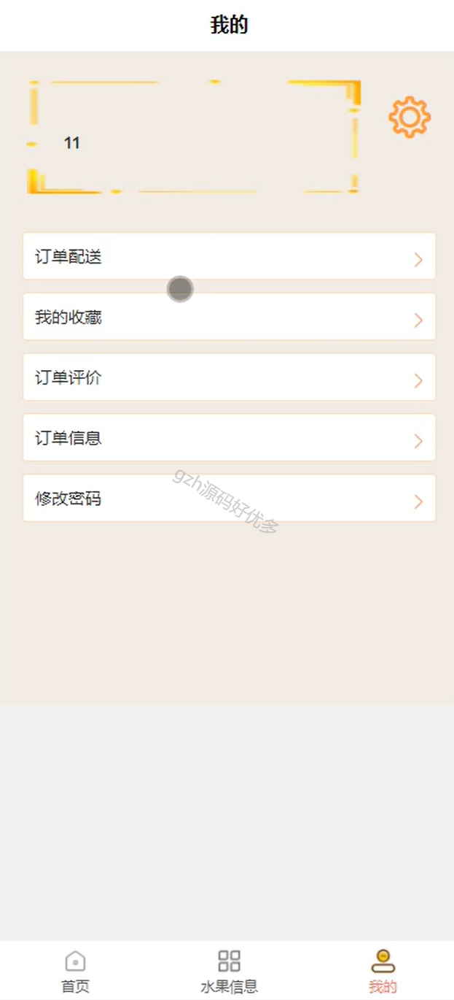
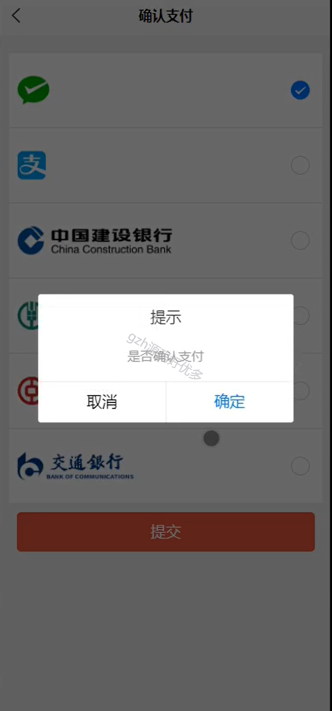
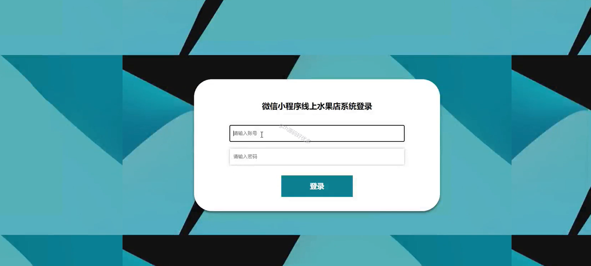
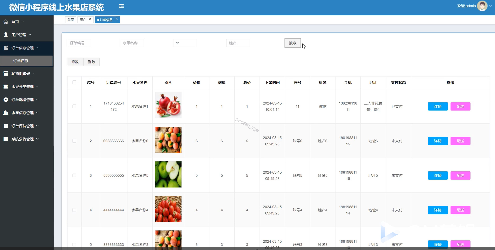
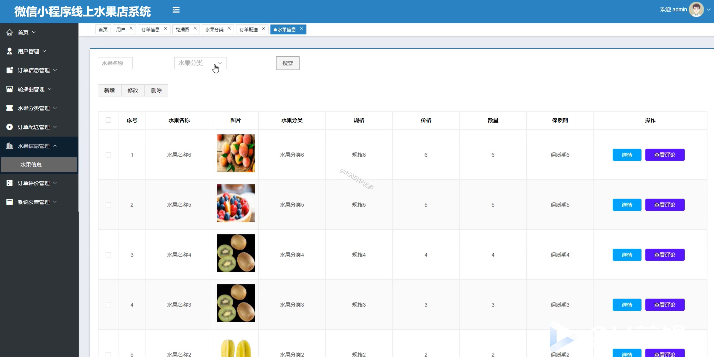

# mpweixinA065
mpweixinA065线上水果店微信小程序（Vue3+原生+unipp）
 
## 查看主页获取源码

### 一、作品包含

源码+数据库+全套环境和工具资源+部署教程

### 二、项目技术

前端技术：Html、Css、Js、Vue3.0、Element-ui、Uniapp

数据库：MySQL

后端技术：Java、Spring Boot、MyBatis

  

### 三、运行环境

开发工具：IDEA/eclipse + HBuilderX + 微信开发者工具

数据库：MySQL5.7（最低要5.7版本）

数据库管理工具：Navicat10以上版本

环境配置软件： JDK1.8+Maven3.6.3

前端Nodejs：16

### 四、项目介绍
项目编号：mpweixinA065

实现了一个基于微信小程序的水果商城，在满足水果销售行业数字化转型需求方面成果显著。从功能实现角度来看，该商城针对管理员和用户分别设计了全面且实用的功能模块。管理员可通过系统进行用户、商品、订单等多方面的高效管理，涵盖从用户信息审核到水果上下架、订单状态跟踪等操作，极大提升了运营管理效率。用户则能在小程序内便捷地完成水果选购、管理个人订单及收藏等操作，享受丰富多样且个性化的购物体验。

### 五、运行截图

  
